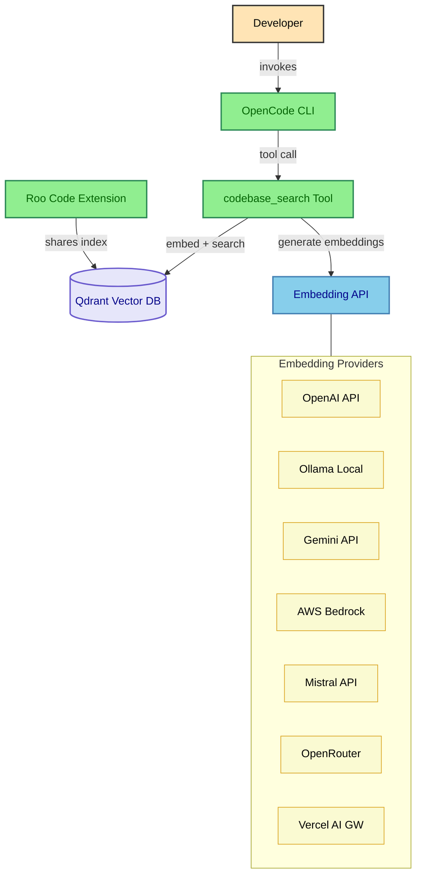
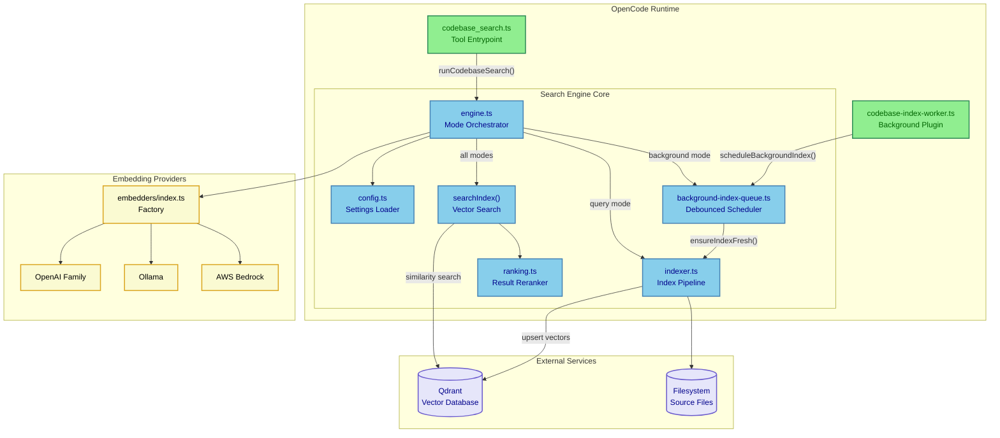
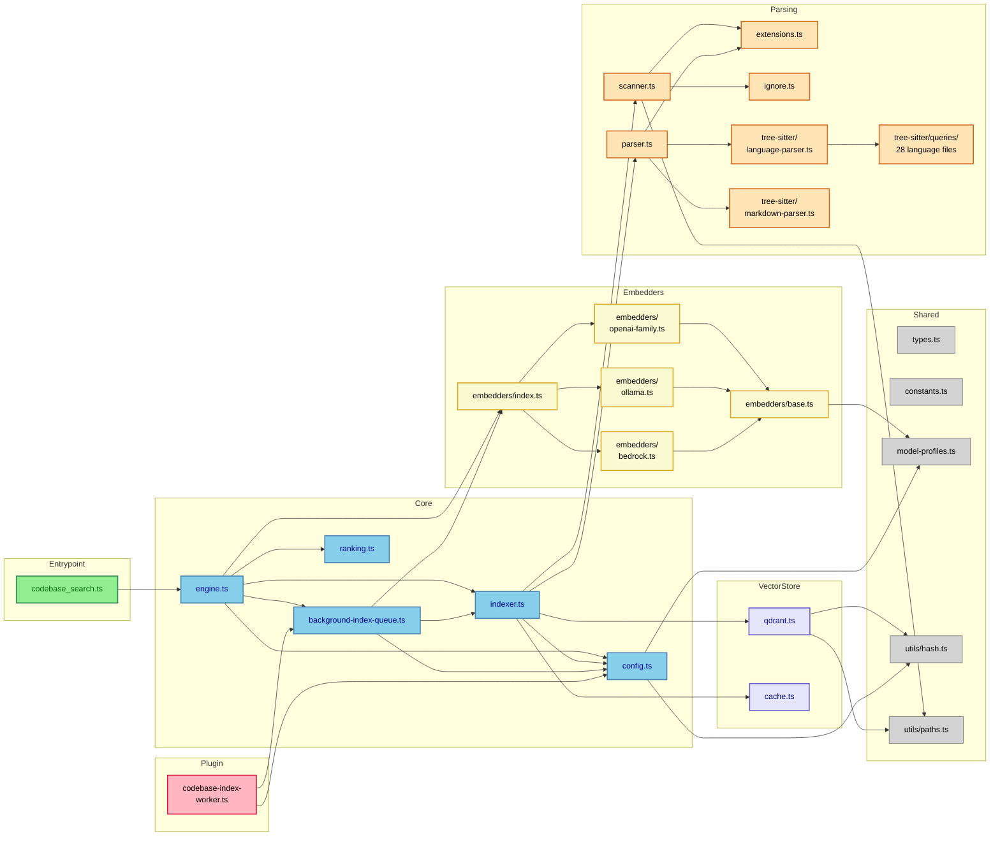
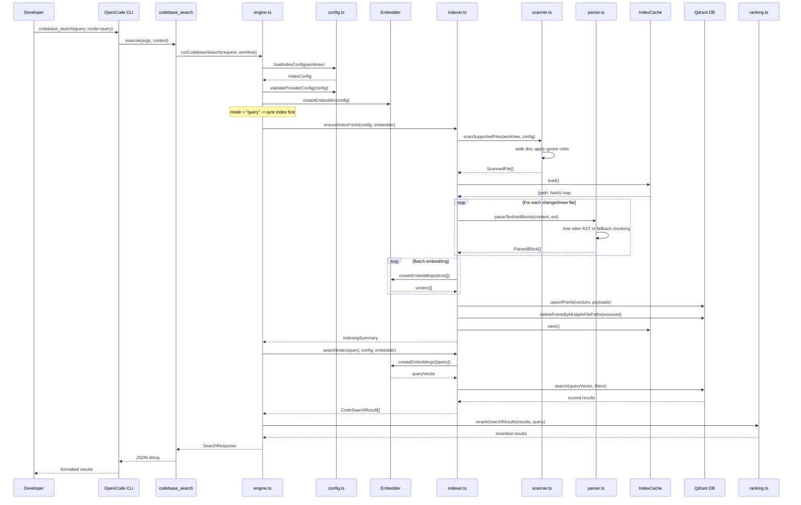
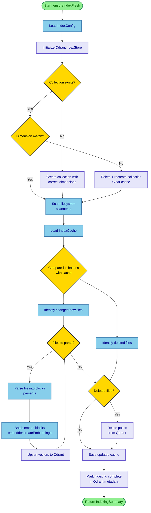
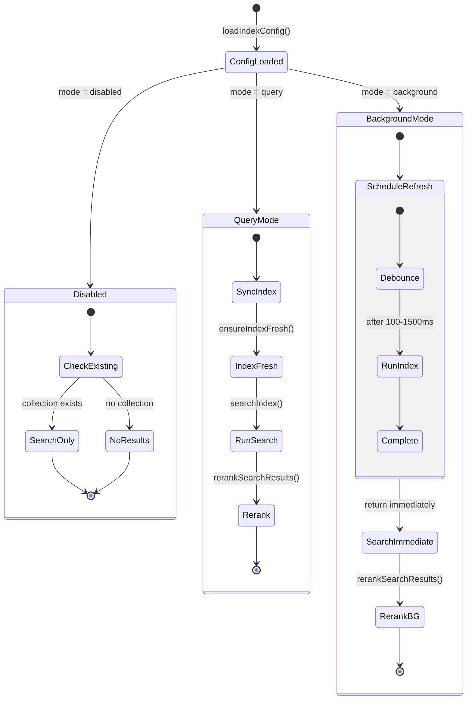
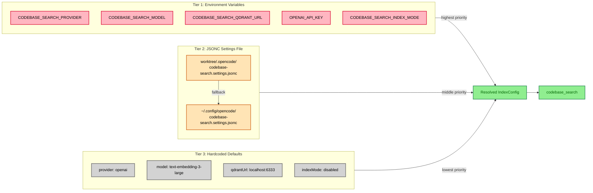
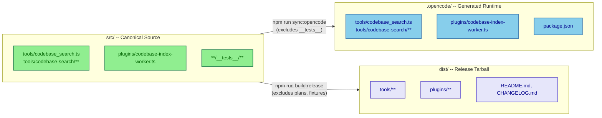

# Architecture

## System Context (C4 Level 1)

How opencode-codebase-search fits into the broader development environment.

**Key relationships:**

- The developer interacts with OpenCode CLI, which discovers and calls `codebase_search`
- The tool connects to a local or remote Qdrant instance for vector storage/search
- Embeddings are generated via one of 8 supported provider backends
- Roo Code can share the same Qdrant collection -- indexes are compatible and concurrent

---

## Container View (C4 Level 2)

Internal containers showing the tool entrypoint, search engine, plugin, and external services.

---

## Component Diagram -- Module Boundaries

Detailed internal module dependencies showing the import graph.

---

## Sequence Diagram -- Query Mode Search Flow

End-to-end request flow when a user invokes `codebase_search` in `query` mode.

---

## Activity Diagram -- Indexing Pipeline

The incremental indexing workflow that runs during `query` mode or background refresh.

---

## State Diagram -- Index Mode Lifecycle

How the three indexing modes (`disabled`, `query`, `background`) behave.

---

## Configuration Resolution

How settings are resolved across three tiers.

---

## Source vs Runtime Layout

---

## Runtime components

- `src/tools/codebase_search.ts`
  - OpenCode tool contract and argument validation
  - delegates execution to engine

- `src/tools/codebase-search/engine.ts`
  - top-level mode orchestration (`disabled`, `query`, `background`)
  - provider/config initialization
  - result formatting and reranking application

- `src/tools/codebase-search/indexer.ts`
  - incremental/full indexing flow
  - cache reconciliation and adoption logic
  - file scanning + parsing + embedding + upsert

- `src/tools/codebase-search/parser.ts`
  - tree-sitter and fallback chunking

- `src/tools/codebase-search/qdrant.ts`
  - collection management and vector operations
  - dimension mismatch recreate behavior

- `src/plugins/codebase-index-worker.ts`
  - background trigger wiring from OpenCode events

## Source vs runtime layout

- Canonical editable source: `src/`
- Generated runtime payload: `.opencode/` (created by `npm run sync:opencode`)

Generated runtime folder is intentionally not the source of truth.

## Distribution boundaries

Release assets include only runtime-required payload and top-level docs/templates.

Development-only artifacts remain in-repo but out-of-asset:

- `docs/plans/`
- fixture projects
- test evidence logs
